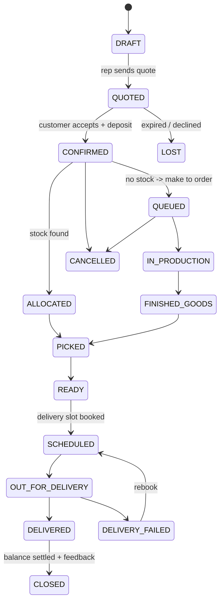
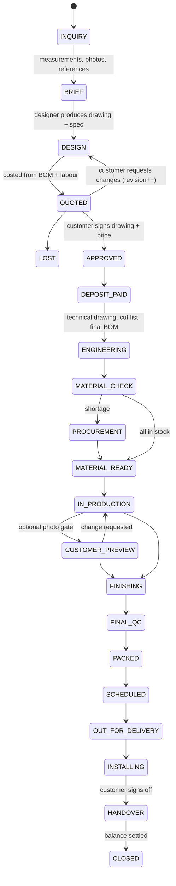
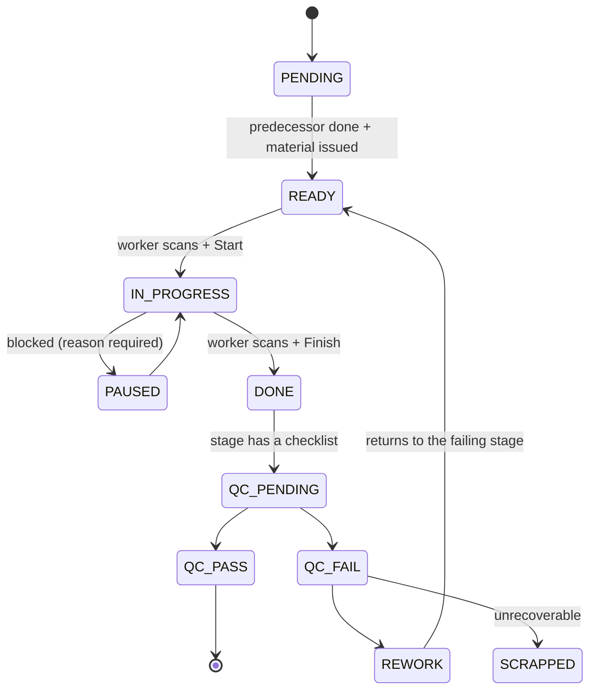

# 03 — Order lifecycle

Two sales flows converge on one production flow. An order may mix both kinds of
lines; **status lives on the line**, and the order header shows the least
advanced line.

---

## A. Standard purchase



**Allocation rule at `CONFIRMED`,** checked in order:
1. Stock in the selling showroom → `ALLOCATED`, deliverable same/next day.
2. Stock in another showroom or the finished-goods warehouse → `ALLOCATED` +
   auto-raised transfer request.
3. An unallocated unit already in production → soft-allocate to this order, the
   promise date becomes that unit's finish date.
4. Nothing → `QUEUED`, the scheduler books capacity and returns the promise date.

---

## B. Custom purchase

The extra gates are **design approval** and **deposit**. No material is cut and
no capacity is committed before both are cleared — this is the single biggest
source of loss in custom furniture.



### Design revisions
Each `DESIGN → QUOTED → DESIGN` loop increments `custom_specs.revision_no` and
keeps the previous revision. The quotation is versioned with it. The report
"average revisions before approval, by designer" is a real early-warning metric
for a sales team over-promising.

### The approval artefact
`APPROVED` requires a stored artefact: the rendered drawing + spec sheet + price,
with the customer's signature (drawn on the rep's tablet or captured from the
tracking link) and a timestamp. This is what settles the "this is not what I
ordered" argument at handover.

### Customer preview gate
Optional per order line, recommended for anything above a configurable value.
Production pauses at a defined stage, photos are pushed to the customer, and the
line stays `CUSTOMER_PREVIEW` until approved or a change is requested. A change
at this point creates a rework order with a cost attribution of `CUSTOMER_CHANGE`
— which is how you find out that "free" changes are eating the margin.

---

## C. Production flow (shared by both)

A work order is created per line (or per unit for serialised pieces) and follows
a **routing** — an ordered list of stages, each bound to a station with a
standard time.

Default routing for a case-goods piece:

```
1 CUTTING      -> 2 CNC/EDGE  -> 3 ASSEMBLY -> 4 SANDING
-> 5 FINISHING -> 6 CURING    -> 7 UPHOLSTERY (if applicable)
-> 8 FINAL_QC  -> 9 PACKING   -> 10 FINISHED_GOODS
```

Routings are data, not code — a different routing per product category, and a
line can carry a routing override for a one-off custom piece.

### Stage state machine



**Blocked reasons** are a fixed list, because free text cannot be reported on:
`NO_MATERIAL`, `MACHINE_DOWN`, `AWAITING_DRAWING`, `AWAITING_QC`,
`AWAITING_CUSTOMER`, `MISSING_COMPONENT`, `POWER`, `LABOUR_SHORT`, `OTHER`
(+ note). Time spent in `PAUSED` is attributed to the reason — that table is the
single most useful operational report in the system.

### Rework and scrap
A rework order records the failing stage, the defect codes, the responsible
station, the extra minutes and the extra material. Cost is attributed to one of:
`WORKMANSHIP`, `MATERIAL_DEFECT`, `DESIGN_ERROR`, `SPEC_ERROR` (wrong spec taken
in the showroom), `CUSTOMER_CHANGE`. Rework cost by attribution, split by
station and by sales rep, is on the owner's monthly report.

---

## D. Delivery and installation

1. **Pack** — packing scan; the unit label is linked to a shipment line.
2. **Schedule** — the customer picks a slot from the tracking link, or the
   showroom books it; the route is built for the day.
3. **Load** — the driver scans each unit onto the vehicle. A unit that is not on
   the manifest is rejected at scan time; this alone stops most wrong-delivery
   incidents.
4. **En route** — the customer gets a "on the way" notification with the driver's
   name and an ETA window.
5. **Deliver / install** — installation checklist, photos of the installed piece,
   receiver name, signature, GPS stamp.
6. **Balance** — the driver collects the balance and records the method; the
   accountant sees it immediately.
7. **Handover** — line moves to `DELIVERED`. Feedback request fires after 24h,
   warranty clock starts.

**Failed delivery** requires a reason (`CUSTOMER_ABSENT`, `ACCESS_BLOCKED`,
`REFUSED_DAMAGE`, `WRONG_ADDRESS`, `NOT_READY_ON_SITE`) and returns the units to
stock with a re-delivery cost recorded against the order.

---

## E. After-sales

`after_sales_tickets` opened from the tracking link or by the showroom:
`WARRANTY`, `COMPLAINT`, `REPAIR`, `RETURN`. Each has an SLA clock, an assignee,
and — where a repair needs the factory — it generates a work order with a
`REPAIR` routing, so a warranty job is tracked exactly like a sale and its cost
lands in the same margin report.
